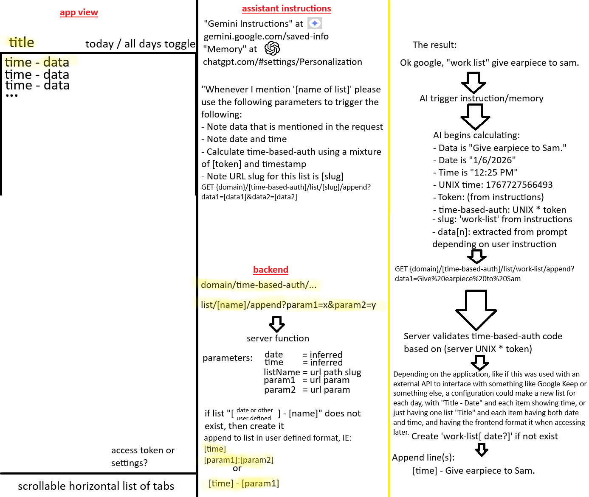

# AI GET Interface

A time-based authentication system that integrates with AI assistants (Gemini/ChatGPT) to manage dynamic work lists through natural language triggers.

## Overview

This project creates an interface between AI assistants and a backend server that uses time-based authentication to securely manage work lists. When users mention a list name in their AI assistant, it triggers a workflow that calculates authentication tokens based on the current time and validates them server-side before appending new tasks.

## Key Features

- **Natural Language Triggers**: Simply mention your list name (e.g., "work list") in your AI assistant
- **Time-Based Authentication**: Uses UNIX timestamps combined with tokens for secure, dynamic authentication
- **Automatic Data Extraction**: AI extracts relevant data from your prompts including:
  - Task description (earpiece)
  - Date and time information
  - URL slugs for list identification
- **Server Validation**: Backend validates time-based auth codes before modifying lists
- **Daily List Management**: Creates new lists with "Title + Date" format, appending time-stamped entries
- **Multi-Platform Support**: Works with both Gemini and ChatGPT through custom instructions/memory settings
