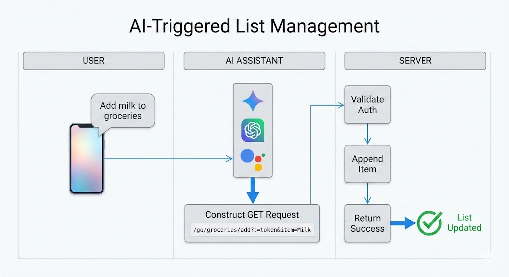

# AI GET Interface

A list management app where AI assistants (Gemini, ChatGPT, Google Assistant) append items via authenticated GET requests. Users create lists, configure fields, and receive generated instructions to paste into their AI assistant's memory.

## How It Works

Tell your AI assistant something like *"Add milk to my grocery list"* — it constructs and calls:

```
GET /go/groceries/add?t=abc123&item=Milk&qty=2
```

The server validates auth, appends the item, and your list updates instantly.

## Authentication Methods

| Method | Description |
|--------|-------------|
| **Static Token** | Per-list token included in URL — simple, works everywhere |
| **Session Auth** | No token needed — user must be logged into the web app |
| **Time-Based HMAC** | *Planned* — stronger security via rolling codes ([constraints](MARKDOWN/REFERENCE/SECURITY_PROBLEM_CONSTRAINTS.md)) |

## Supported AI Platforms

- **Gemini** → Saved Info
- **ChatGPT** → Memory / Custom Instructions  
- **Google Assistant** → Routines

## Frontend Features

- Chat-style collapsible sidebar (à la ChatGPT/Gemini)
- Draft → publish list creation workflow
- Custom field definitions (text/number, required/optional)
- Auto-generated copy-paste instructions per AI platform
- Manual item entry and inline deletion
- Sort by any field, filter by time (Today / 24h / All)

## Tech Stack

Next.js 16 · React 19 · Prisma 7 + Neon · Tailwind 4 · Stack Auth

